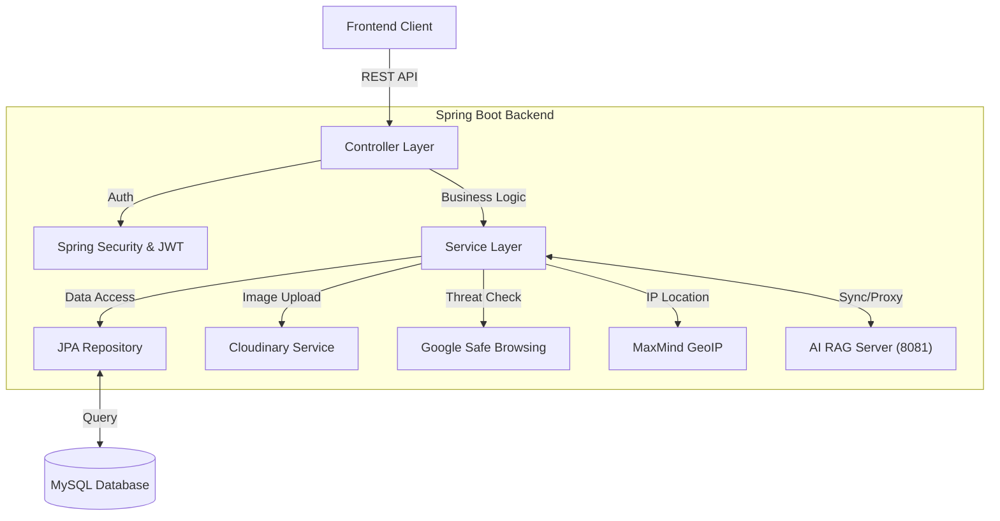

# 🛡️ QRex Backend API Server

**QRex Backend**는 QR코드 및 URL 피싱 탐지 플랫폼 **QRex**의 메인 비즈니스 서버입니다.
사용자 인증(Auth), 커뮤니티(Community), 분석 기록 관리(Analysis History), 그리고 AI 서버와의 통신을 담당하는 중추적인 역할을 수행합니다.

> **Project QRex (404 FOUND Team)**
> **Main Backend Repository**

---

## 🚀 Key Features

### 1. 🔐 Robust Authentication & Security
- **JWT 기반 인증:** `JwtTokenProvider`와 `JwtAuthenticationFilter`를 통한 Stateless 인증 시스템을 구축했습니다.
- **OAuth 2.0 연동:** Google 및 Kakao 소셜 로그인을 완벽하게 지원하며, `CustomOAuth2UserService`를 통해 자체 DB와 회원 정보를 동기화합니다.
- **토큰 보안:** 로그아웃 시 토큰을 무효화하는 **Blacklist 시스템**(`TokenBlacklistService`)을 구현하여 보안성을 강화했습니다.
- **정교한 CORS 설정:** 프론트엔드 및 개발 서버 IP에 대한 CORS 정책을 `SecurityConfig`에서 중앙 관리합니다.

### 2. 🛡️ Advanced Phishing Analysis Pipeline
- **RAG 연동:** 사용자의 분석 요청을 받아 AI RAG Server(8081 포트)로 중계(`AiProxyController`)하고 결과를 저장합니다.
- **위협 인텔리전스 통합:**
    - **Google Safe Browsing API:** URL의 알려진 위협 여부를 실시간으로 조회합니다.
    - **GeoIP Integration:** `MaxMind GeoIP2` 라이브러리를 통해 서버 자체적으로 IP의 물리적 위치(국가/도시)를 추적합니다.

### 3. 👥 Community & Content Management
- **게시판 CRUD:** 사용자가 피싱 사례를 공유할 수 있는 게시판과 댓글 기능을 제공합니다.
- **이미지 처리:** `Cloudinary` 연동을 통해 게시글 내 이미지 업로드 및 최적화된 URL 생성을 지원합니다.
- **신고 시스템:** 악성 게시글 및 댓글에 대한 신고 누적 시 자동 삭제 로직(`REPORT_LIMIT`)이 적용되어 있습니다.

### 4. ⚙️ System & Infrastructure
- **Swagger UI:** `SpringDoc OpenAPI`를 도입하여 API 문서를 자동으로 생성하고 테스트 환경을 제공합니다.
- **JPA & MySQL:** 효율적인 데이터 관리를 위해 Spring Data JPA와 MySQL을 사용하며, 복잡한 쿼리는 Native Query로 최적화했습니다.

---

## 🛠 Tech Stack

| Category | Technology | Description |
| :--- | :--- | :--- |
| **Framework** | **Spring Boot 3.3.6** | 안정적인 엔터프라이즈급 애플리케이션 구축 |
| **Language** | **Java 21** | 최신 LTS 버전 활용 |
| **Security** | **Spring Security 6** | 인증/인가 및 OAuth2 클라이언트 구현 |
| **Database** | **MySQL 8.0** | 관계형 데이터 저장소 |
| **ORM** | **Spring Data JPA** | 객체 중심의 데이터 접근 계층 구현 |
| **API Docs** | **Swagger (SpringDoc)** | REST API 문서화 및 테스트 도구 |
| **Utils** | `Cloudinary`, `GeoIP2`, `Google Safe Browsing` | 이미지 호스팅 및 위협 정보 조회 |

---

## 📂 System Architecture (Backend)

---

## 🔌 API Documentation (Swagger)

서버 실행 후 아래 주소에서 API 명세를 확인할 수 있습니다.
- **Swagger UI:** https://api.qrex.kro.kr/swagger-ui/index.html

### 주요 API 그룹
- **Auth:** `/api/auth` (로그인, 회원가입, 프로필 수정, 탈퇴)
- **Community:** `/api/community` (게시글/댓글 CRUD, 신고)
- **Analysis:** `/api/analysis` (QR 분석 요청, 기록 조회)
- **AI Agent:** `/api/ai/chat` (AI 챗봇 중계)

---

## 🔍 Core Logic Highlights

### 🔄 AI Proxy Controller (`AiProxyController`)
프론트엔드와 AI 서버 간의 **직접 통신을 차단**하고, 백엔드가 중계 역할을 수행합니다.
- **보안:** AI 서버의 IP와 포트를 외부에 노출하지 않습니다.
- **인증 통합:** 로그인된 사용자의 경우 실제 DB ID를, 비로그인 사용자는 임시 ID를 AI 서버에 전달하여 대화 맥락을 유지합니다.

### 🛡️ Token Blacklist Service
JWT는 발급 후 만료 전까지 유효하다는 단점이 있습니다. 이를 보완하기 위해 **로그아웃 요청된 토큰을 메모리(Set)에 저장**하여 차단하는 `TokenBlacklistService`를 구현했습니다.
